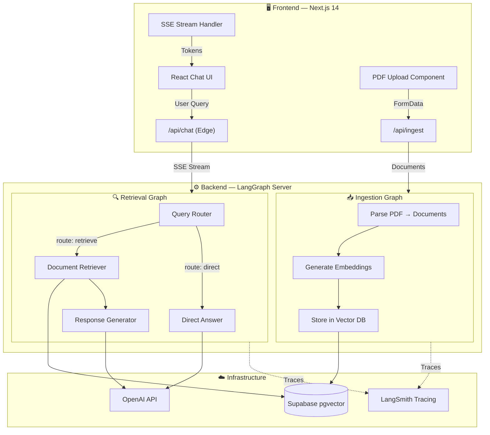
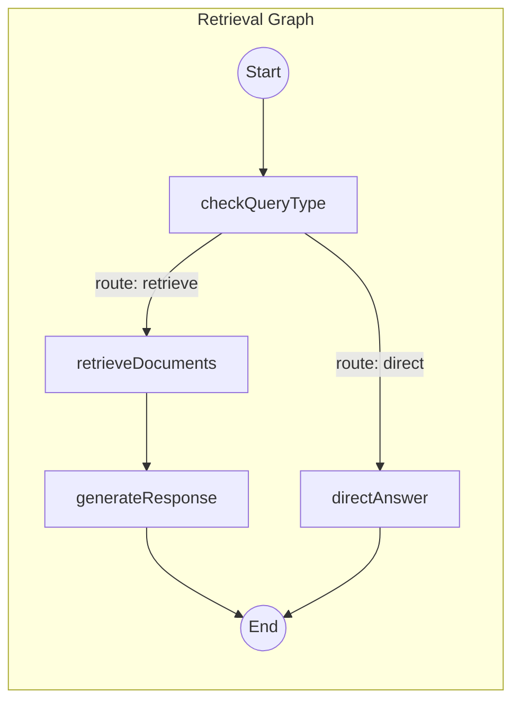
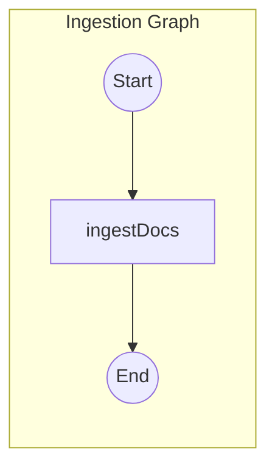

<p align="center">
  <h1 align="center">📄 PDF RAG Chatbot</h1>
  <p align="center">
    <strong>Intelligent Document Q&A powered by LangChain, LangGraph & OpenAI</strong>
  </p>
  <p align="center">
    Upload PDFs → Store Embeddings → Chat with Your Documents
  </p>
  <p align="center">
    <a href="#features">Features</a> •
    <a href="#architecture">Architecture</a> •
    <a href="#llm--prompt-engineering-deep-dive">LLM Deep-Dive</a> •
    <a href="#quick-start">Quick Start</a> •
    <a href="#deployment">Deployment</a>
  </p>
  <p align="center">
    
    
    
    
    
    
    
  </p>
</p>

---

## 🌟 Overview

**PDF RAG Chatbot** is a production-grade, full-stack **Retrieval-Augmented Generation (RAG)** application that enables users to upload PDF documents and have intelligent conversations with their content. It combines LangChain's powerful abstractions, LangGraph's state machine orchestration, and OpenAI's GPT-4o to deliver accurate, context-aware answers with source citations.

> **Built by [VENNA PAVAN ADITHYA](https://github.com/AdithyaVenna)** — A scalable reference architecture for building LLM-powered document intelligence systems.

---

## ✨ Features

| Category | Feature | Description |
|----------|---------|-------------|
| 🧠 **AI Core** | Intelligent Query Routing | Zod-validated structured output classifies queries as `retrieve` vs `direct` |
| 🧠 **AI Core** | RAG Pipeline | Full retrieve → rank → generate pipeline with source attribution |
| 🧠 **AI Core** | Multi-Provider LLM Support | 15+ providers: OpenAI, Anthropic, Google, Mistral, Groq, DeepSeek, etc. |
| 📄 **Document Processing** | PDF Ingestion Graph | Automated parsing, chunking, and vector embedding of PDF documents |
| 📄 **Document Processing** | Persistent Vector Store | Supabase pgvector for durable, queryable document embeddings |
| 🖥️ **Frontend** | Real-Time Streaming | Server-Sent Events (SSE) for token-by-token response streaming |
| 🖥️ **Frontend** | Source Citations | Expandable source cards with page numbers and document metadata |
| 🖥️ **Frontend** | Thread-Based Sessions | Isolated conversation threads per user session |
| 🔧 **DevOps** | LangSmith Tracing | Full observability and debugging of every LLM call and graph step |
| 🔧 **DevOps** | CI/CD Pipeline | GitHub Actions for formatting and linting checks |
| 🔧 **DevOps** | Monorepo with Turborepo | Unified build system for frontend + backend |

---

## 🏗️ Architecture



**Data Flow:**
1. **Upload** → PDFs are parsed into `Document` objects via `PDFLoader`, then embedded using `text-embedding-3-small` and stored in Supabase
2. **Query** → User questions are routed through a classification step, then either answered directly or answered with retrieved context
3. **Stream** → Responses stream token-by-token via SSE back to the React UI with source citations

---

## 🧠 LLM & Prompt Engineering Deep-Dive

This section documents the advanced LLM techniques, prompt frameworks, context engineering strategies, and evaluation methods used in this project.

### 1. Prompt Framework — ChatPromptTemplate (Role-Based)

The project uses LangChain's `ChatPromptTemplate.fromMessages()` — a role-based prompt framework that separates system instructions from user input for optimal LLM performance.

**Router Prompt** — Classifies whether a query needs document retrieval:
```typescript
// src/retrieval_graph/prompts.ts
const ROUTER_SYSTEM_PROMPT = ChatPromptTemplate.fromMessages([
  ['system', `You are a routing assistant. Your job is to determine if a 
   question needs document retrieval or can be answered directly.
   Respond with either:
   'retrieve' - if the question requires retrieving documents
   'direct' - if the question can be answered directly AND your direct answer`],
  ['human', '{query}'],
]);
```

**Response Prompt** — Generates answers grounded in retrieved context:
```typescript
const RESPONSE_SYSTEM_PROMPT = ChatPromptTemplate.fromMessages([
  ['system', `You are an assistant for question-answering tasks. 
   Use the following pieces of retrieved context to answer the question. 
   If you don't know the answer, just say that you don't know. 
   Use three sentences maximum and keep the answer concise.
   
   question: {question}
   context: {context}`],
]);
```

**Why this approach:**
- **Role separation** (system vs human) ensures the LLM understands its constraints
- **Template variables** (`{query}`, `{context}`) enable dynamic context injection
- **Conciseness constraint** ("three sentences maximum") prevents hallucination via verbosity

### 2. Structured Output — Zod Schema Validation

Instead of parsing free-text LLM responses, the router uses **Zod-validated structured output** to enforce a schema on the LLM's response:

```typescript
const schema = z.object({
  route: z.enum(['retrieve', 'direct']),
  directAnswer: z.string().optional(),
});

const response = await model
  .withStructuredOutput(schema)  // ← Forces LLM to respond in schema
  .invoke(formattedPrompt.toString());
```

**Benefits:**
- **Type-safe routing** — No regex parsing or string matching
- **Eliminates hallucinated routes** — LLM can only output `'retrieve'` or `'direct'`
- **Optional fields** — `directAnswer` is only populated when `route === 'direct'`

### 3. Context Engineering — XML-Tagged Document Formatting

Retrieved documents are formatted using **XML tags** before injection into the prompt — a technique recommended by Anthropic and effective across all major LLMs:

```typescript
// src/retrieval_graph/utils.ts
export function formatDocs(docs?: Document[]): string {
  if (!docs || docs.length === 0) {
    return '<documents></documents>';
  }
  const formatted = docs.map(formatDoc).join('\n');
  return `<documents>\n${formatted}\n</documents>`;
}

function formatDoc(doc: Document): string {
  const metadata = doc.metadata || {};
  const meta = Object.entries(metadata)
    .map(([k, v]) => ` ${k}=${v}`)
    .join('');
  return `<document${meta}>\n${doc.pageContent}\n</document>`;
}
```

**Why XML tags:**
- **Clear boundaries** — LLMs can distinguish between document content and instructions
- **Metadata preservation** — Source, page number, and UUID are embedded as XML attributes
- **Multi-document support** — Each `<document>` is individually tagged within `<documents>`
- **Grounding signal** — Reduces hallucination by making the context boundary explicit

### 4. LangGraph State Machine — Agentic Workflow Orchestration

Both the ingestion and retrieval pipelines are built as **LangGraph state graphs** — a deterministic state machine approach to AI orchestration:





**Key design decisions:**
- **Conditional edges** — `routeQuery` dynamically routes between `retrieveDocuments` and `directAnswer`
- **State annotations** — `AgentStateAnnotation` with `MessagesAnnotation` manages conversation history
- **Custom reducers** — `reduceDocs` handles document deduplication via UUID tracking
- **Configurable at runtime** — Model, retriever, k-value can all be overridden per request

### 5. RAG Pipeline Architecture

| Stage | Implementation | Details |
|-------|---------------|---------|
| **Document Loading** | `PDFLoader` (LangChain) | Extracts text per page with metadata |
| **Embedding Model** | `text-embedding-3-small` (OpenAI) | 1536-dim vectors, cost-efficient |
| **Vector Store** | Supabase pgvector | `documents` table + `match_documents` RPC for similarity search |
| **Retrieval** | `VectorStoreRetriever` | Top-k similarity search (default k=5) with configurable filters |
| **Generation Model** | GPT-4o / GPT-4o-mini | Configurable via `provider/model-name` format |
| **Streaming** | SSE (Server-Sent Events) | Token-by-token streaming with `streamMode: ['messages', 'updates']` |

### 6. Multi-Provider LLM Support

The `loadChatModel()` utility supports **15+ LLM providers** with a universal interface:

```
openai/gpt-4o  |  anthropic/claude-3-sonnet  |  google-genai/gemini-pro
groq/llama-3   |  mistralai/mistral-large    |  deepseek/deepseek-chat
together/...   |  fireworks/...              |  ollama/llama3
azure_openai/  |  cohere/...                 |  bedrock/...
google-vertexai/  |  cerebras/...            |  xai/grok-1
```

Switch models by changing a single config:
```typescript
// frontend/constants/graphConfigs.ts
export const retrievalAssistantStreamConfig = {
  queryModel: 'openai/gpt-4o-mini',  // ← Change this to any provider/model
  retrieverProvider: 'supabase',
  k: 5,
};
```

### 7. Observability & Evaluation — LangSmith Integration

The project integrates **LangSmith** for full-stack LLM observability:

- **Trace every call** — Each graph node, LLM invocation, and retrieval step is traced
- **Named runs** — Graphs are tagged (`RetrievalGraph`, `IngestionGraph`) for easy filtering
- **Latency monitoring** — Track response times per node
- **Prompt debugging** — Inspect exact prompts sent to the LLM at each step
- **Evaluation-ready** — Traces can be used to build evaluation datasets for regression testing

Enable with:
```env
LANGCHAIN_TRACING_V2=true
LANGCHAIN_API_KEY=your-langsmith-api-key
LANGCHAIN_PROJECT="pdf-chatbot"
```

### 8. Tools Integration

| Tool | Purpose | Integration Point |
|------|---------|-------------------|
| **LangGraph CLI** | Local dev server for graph execution | `npx @langchain/langgraph-cli dev` |
| **LangGraph Studio** | Visual graph debugger and step inspector | Auto-launched with `langgraph:dev` |
| **LangSmith** | Tracing, evaluation, prompt playground | ENV-configured, zero-code |
| **Supabase Client** | Vector store CRUD + similarity search | `@supabase/supabase-js` |
| **Zod** | Runtime type validation for LLM outputs | Structured output schemas |
| **Turborepo** | Monorepo build orchestration | `turbo.json` pipeline config |

---

## 🛠 Tech Stack

| Layer | Technology | Version |
|-------|-----------|---------|
| **Frontend** | Next.js (React) | 14.2 |
| **UI Components** | shadcn/ui + Radix UI | Latest |
| **Styling** | Tailwind CSS | 3.4 |
| **Backend Runtime** | Node.js + TypeScript | 20+ / 5.3 |
| **LLM Framework** | LangChain + LangGraph | 0.3 / 0.2 |
| **LLM Provider** | OpenAI (GPT-4o) | Latest |
| **Embeddings** | OpenAI text-embedding-3-small | Latest |
| **Vector Database** | Supabase (pgvector) | Latest |
| **Validation** | Zod | 3.24 |
| **Build System** | Turborepo | Latest |
| **CI/CD** | GitHub Actions | - |
| **Observability** | LangSmith | - |

---

## 📁 Project Structure

```
pdf-rag-chatbot/
├── backend/                          # LangGraph AI backend
│   ├── src/
│   │   ├── ingestion_graph/          # PDF ingestion pipeline
│   │   │   ├── graph.ts              # StateGraph: parse → embed → store
│   │   │   ├── configuration.ts      # Ingestion config (docsFile, useSampleDocs)
│   │   │   └── state.ts              # IndexStateAnnotation
│   │   ├── retrieval_graph/          # RAG question-answering pipeline
│   │   │   ├── graph.ts              # StateGraph: route → retrieve → generate
│   │   │   ├── prompts.ts            # ChatPromptTemplate definitions
│   │   │   ├── configuration.ts      # Agent config (queryModel)
│   │   │   ├── state.ts              # AgentStateAnnotation
│   │   │   └── utils.ts              # XML document formatter
│   │   └── shared/                   # Shared utilities
│   │       ├── configuration.ts      # Base config (retriever, k, filters)
│   │       ├── retrieval.ts          # Supabase retriever factory
│   │       ├── state.ts              # Document reducer (deduplication)
│   │       └── utils.ts              # Multi-provider model loader
│   ├── __tests__/                    # Unit & integration tests
│   ├── langgraph.json                # LangGraph graph registry
│   └── demo.ts                       # CLI demo script
├── frontend/                          # Next.js web application
│   ├── app/
│   │   ├── api/
│   │   │   ├── chat/route.ts         # SSE streaming chat endpoint
│   │   │   └── ingest/route.ts       # PDF upload & ingestion endpoint
│   │   ├── page.tsx                  # Main chat interface
│   │   └── layout.tsx                # Root layout
│   ├── components/                   # React UI components
│   │   ├── chat-message.tsx          # Message bubble with sources
│   │   ├── file-preview.tsx          # PDF file preview card
│   │   └── example-prompts.tsx       # Suggested prompts
│   ├── lib/                          # Client libraries
│   │   ├── langgraph-base.ts         # LangGraph SDK wrapper
│   │   ├── langgraph-client.ts       # Browser-side client
│   │   ├── langgraph-server.ts       # Server-side client
│   │   └── pdf.ts                    # PDF processing utility
│   ├── constants/graphConfigs.ts     # Model & retriever configuration
│   ├── types/graphTypes.ts           # TypeScript type definitions
│   └── hooks/                        # Custom React hooks
├── .github/workflows/ci.yml          # GitHub Actions CI pipeline
├── turbo.json                         # Turborepo pipeline config
├── package.json                       # Root workspace config
└── README.md                          # ← You are here
```

---

## 🚀 Quick Start

### Prerequisites

- **Node.js** v18+ (v20 recommended)
- **Yarn** package manager
- **Supabase** project with pgvector enabled
- **OpenAI** API key

### 1. Clone & Install

```bash
git clone https://github.com/AdithyaVenna/pdf-rag-chatbot.git
cd pdf-rag-chatbot
yarn install
```

### 2. Configure Environment

```bash
# Backend
cp backend/.env.example backend/.env

# Frontend
cp frontend/.env.example frontend/.env
```

### 3. Set Up Supabase

Create a `documents` table and `match_documents` function in your Supabase project. See the [LangChain Supabase docs](https://js.langchain.com/docs/integrations/vectorstores/supabase/) for the SQL setup.

### 4. Start Development

```bash
# Terminal 1 — Backend (LangGraph server on port 2024)
cd backend && yarn langgraph:dev

# Terminal 2 — Frontend (Next.js on port 3000)
cd frontend && yarn dev
```

### 5. Use the App

1. Open `http://localhost:3000`
2. Click the 📎 icon to upload a PDF (max 5 files, 10MB each)
3. Ask questions about your documents
4. View streamed answers with expandable source citations

---

## 🔐 Environment Variables

### Backend (`backend/.env`)

| Variable | Required | Description |
|----------|----------|-------------|
| `OPENAI_API_KEY` | ✅ | OpenAI API key for GPT-4o and embeddings |
| `SUPABASE_URL` | ✅ | Your Supabase project URL |
| `SUPABASE_SERVICE_ROLE_KEY` | ✅ | Supabase service role key (not anon key) |
| `LANGCHAIN_TRACING_V2` | ❌ | Set to `true` for LangSmith tracing |
| `LANGCHAIN_API_KEY` | ❌ | LangSmith API key |
| `LANGCHAIN_PROJECT` | ❌ | LangSmith project name (default: `pdf-chatbot`) |

### Frontend (`frontend/.env`)

| Variable | Required | Description |
|----------|----------|-------------|
| `NEXT_PUBLIC_LANGGRAPH_API_URL` | ✅ | LangGraph backend URL (default: `http://localhost:2024`) |
| `LANGGRAPH_INGESTION_ASSISTANT_ID` | ✅ | Ingestion graph ID (default: `ingestion_graph`) |
| `LANGGRAPH_RETRIEVAL_ASSISTANT_ID` | ✅ | Retrieval graph ID (default: `retrieval_graph`) |
| `LANGCHAIN_API_KEY` | ❌ | LangSmith API key |
| `LANGCHAIN_TRACING_V2` | ❌ | Enable tracing |
| `LANGCHAIN_PROJECT` | ❌ | LangSmith project name |

---

## 📡 API Reference

### `POST /api/chat`

Chat with ingested documents via SSE streaming.

**Request:**
```json
{
  "message": "What is this document about?",
  "threadId": "thread_abc123"
}
```

**Response:** Server-Sent Events stream with `messages/partial` and `updates` events.

### `POST /api/ingest`

Upload and ingest PDF documents.

**Request:** `multipart/form-data` with `files` field (max 5 PDFs, 10MB each).

**Response:**
```json
{
  "message": "Documents ingested successfully",
  "threadId": "thread_xyz789"
}
```

---

## ⚙️ Customization Guide

### Change the LLM Model

Edit `frontend/constants/graphConfigs.ts`:
```typescript
export const retrievalAssistantStreamConfig = {
  queryModel: 'anthropic/claude-3-sonnet',  // Switch to Claude
  retrieverProvider: 'supabase',
  k: 10,  // Retrieve more documents
};
```

### Modify Prompts

Edit `backend/src/retrieval_graph/prompts.ts` to adjust the system prompts for routing and response generation.

### Add a New Vector Store

1. Create a new retriever function in `backend/src/shared/retrieval.ts`
2. Add the provider to the `switch` statement in `makeRetriever()`
3. Update the `retrieverProvider` type in `backend/src/shared/configuration.ts`

### Adjust Retrieval Parameters

- **k** (number of documents): Change in `graphConfigs.ts` or pass at runtime
- **filters**: Use `filterKwargs` for metadata-based filtering
- **embedding model**: Modify `makeSupabaseRetriever()` in `retrieval.ts`

---

## 🚢 Deployment

### Backend

- **LangGraph Cloud**: Follow the [LangGraph Cloud guide](https://langchain-ai.github.io/langgraph/cloud/quick_start/#deploy-to-langgraph-cloud)
- **Self-Hosted**: Follow the [self-hosting guide](https://langchain-ai.github.io/langgraph/how-tos/deploy-self-hosted/)

### Frontend

Deploy to any Next.js-compatible host:

```bash
# Vercel (recommended)
npx vercel deploy

# Or build manually
cd frontend && yarn build && yarn start
```

> ⚠️ Set `NEXT_PUBLIC_LANGGRAPH_API_URL` to your deployed backend URL.

---

## 🧪 Testing

```bash
# Run all backend tests
cd backend && yarn test

# Run frontend tests
cd frontend && yarn test

# Run with coverage
cd backend && yarn test:coverage

# Run integration tests only
cd backend && yarn test:int

# Lint & format
yarn lint
yarn format:check
```

---

## 🔧 Troubleshooting

| Issue | Solution |
|-------|----------|
| `.env` not loading | Ensure you copied `.env.example` → `.env` in both `backend/` and `frontend/`. Restart dev servers. |
| Supabase errors | Verify `documents` table and `match_documents` function exist. Check RLS policies. |
| OpenAI 401/429 | Verify `OPENAI_API_KEY` is valid and has sufficient quota. |
| LangGraph won't start | Ensure Node.js ≥ 18 and dependencies are installed (`yarn install`). |
| Frontend can't connect | Check `NEXT_PUBLIC_LANGGRAPH_API_URL` matches your backend port. |
| Streaming errors | Ensure both `LANGGRAPH_RETRIEVAL_ASSISTANT_ID` and `LANGGRAPH_INGESTION_ASSISTANT_ID` are set. |

---

## 🗺️ Roadmap

- [ ] **Conversation persistence** — Store chat history in a database across sessions
- [ ] **Multi-format support** — DOCX, TXT, Markdown, HTML ingestion
- [ ] **Hybrid search** — Combine vector similarity with keyword (BM25) search
- [ ] **User authentication** — Per-user document isolation
- [ ] **Evaluation pipeline** — Automated RAG quality scoring with RAGAS metrics
- [ ] **Reranking** — Add a cross-encoder reranker (Cohere, BGE) for improved precision
- [ ] **Chunking strategies** — Semantic chunking, parent-child retrieval
- [ ] **Docker compose** — One-command deployment with Docker
- [ ] **Admin dashboard** — Document management, usage analytics, model switching

---

## 🤝 Contributing

Contributions are welcome! Please:

1. Fork the repository
2. Create a feature branch (`git checkout -b feature/amazing-feature`)
3. Commit your changes (`git commit -m 'Add amazing feature'`)
4. Push to the branch (`git push origin feature/amazing-feature`)
5. Open a Pull Request

Ensure all contributions include tests and pass the CI pipeline (`yarn lint && yarn format:check`).

---

## 📄 License

This project is licensed under the **MIT License** — see the [LICENSE](LICENSE) file for details.

---

<p align="center">
  <strong>Built with ❤️ by <a href="https://github.com/AdithyaVenna">VENNA PAVAN ADITHYA</a></strong>
  <br />
  <sub>⭐ Star this repo if you find it helpful!</sub>
</p>
